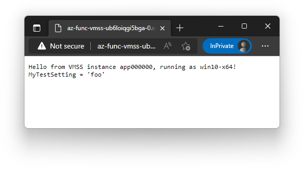
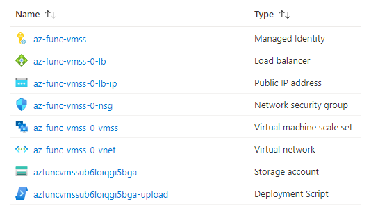

# az-func-vmss

**This repository is for my blog post [Run Azure Functions on Virtual Machine Scale Sets](https://www.joelverhagen.com/blog/2022/05/azure-functions-on-vmss). Read it for more context and background.**

## Introduction

This repository contains an example of how you can run Azure Functions on Azure VM scale-sets (VMSS).

This example uses a [spot VM](https://azure.microsoft.com/en-us/services/virtual-machines/spot/) based VM scale set. If you pick your region and SKU well, you can run your workloads on the cheap. Save 💰.

Some stuff baked into this example:

- The VMSS defaults to the [`Standard_D2as_v4`](https://docs.microsoft.com/en-us/azure/virtual-machines/dav4-dasv4-series#dasv4-series) SKU. It's really cheap right now (May 2022) in the `West US 2` region.
- The Azure Functions Host [version 4.3.0](https://github.com/Azure/azure-functions-host/releases/tag/v4.3.0) is used.
- The ARM template deploys a load balancer so that HTTP triggers are accessible. This might not be needed if your app just uses [queue](https://docs.microsoft.com/en-us/azure/azure-functions/functions-bindings-storage-queue) or [timer](https://docs.microsoft.com/en-us/azure/azure-functions/functions-bindings-timer) triggers.
- The VMSS uses the `2022-datacenter-core-smalldisk` Windows Server Core image from Microsoft, i.e. the code runs on Windows not Linux.
- [HTTP triggers](https://docs.microsoft.com/en-us/azure/azure-functions/functions-bindings-http-webhook-trigger) are accessible via port 80. No HTTPS and certificate stuff is considered. **This is not ideal.**
- Remote Desktop (RDP) is not enabled in the network security group or load balancer. The only port forwarded is port 80.
- The [installation script](https://github.com/joelverhagen/az-func-vmss/blob/main/scripts/Install-Standalone.ps1) uses the .NET 6.0 runtime to run the host and load the app [in-process](https://docs.microsoft.com/en-us/azure/azure-functions/functions-dotnet-class-library).
- An emphemeral OS disk is used with the largest available [placement](https://docs.microsoft.com/en-us/azure/virtual-machines/ephemeral-os-disks#placement-options-for-ephemeral-os-disks) per SKU. Hopefully your app doesn't need much disk space.
- Deployment files (Azure Functions host, app zip, app environment variables, scripts) from previous deployments are never cleaned up.
- The auto-scale is performed based on (relatively sensitive) CPU thresholds. Nothing fancy like [KEDA](https://keda.sh/) is implemented.
- The auto-scale settings have a minimum of 1 instance and a maximum of 30 instances (configurable).

## Deploy

Publish your Functions app and zip the publish directory. Put your configuration in a [environment file (.env)](https://docs.docker.com/compose/env-file/). Deploy it to a spot VM scale set.

After the deployment completes, go to the domain name associated with one of your load balancer resources, e.g.

`http://az-func-vmss-ub6loiqgi5bga-0.southcentralus.cloudapp.azure.com/api/hello`

The resources in Azure Portal will look something like this:

## Warranty

There is no warranty at all. Do this at your own risk.

YMMV.

*("YMMV" is enough to wash my hands of whatever trouble you kids get yourself into, right?)*
